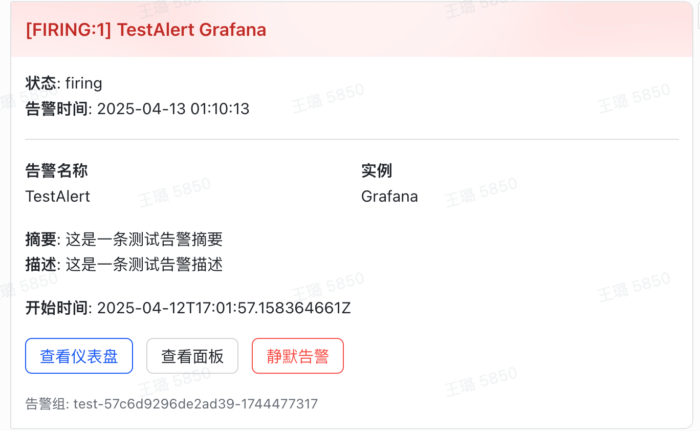

# Grafana告警转飞书机器人

这个项目是一个Python HTTP服务器，用于接收Grafana告警Webhook，并将其转换为飞书机器人消息卡片发送到飞书群聊中。



## 功能特点

- 接收Grafana告警Webhook
- 将告警信息转换为美观的飞书消息卡片
- 显示告警详情、状态、时间等信息
- 提供仪表盘和面板的直接链接按钮
- 支持多告警聚合展示，自动合并同类告警
- 根据告警状态使用不同颜色标识（红色表示告警中，绿色表示已解决）
- 支持自定义时区配置，正确显示告警时间
- 智能实例识别，支持多种标签格式
- 支持标准和非标准Grafana告警格式

## 安装与使用

### 使用 GitHub Container Registry (ghcr.io)

你可以直接使用我们预构建好的 Docker 镜像：

```bash
# 拉取最新版本
docker pull ghcr.io/mereithhh/grafana-alert-to-feishu:latest

# 运行容器（使用默认配置）
docker run -p 5022:5022 -e FEISHU_WEBHOOK_URL="https://open.feishu.cn/open-apis/bot/v2/hook/your-webhook-token" ghcr.io/mereithhh/grafana-alert-to-feishu:latest

# 运行容器（自定义时区）
docker run -p 5022:5022 -e FEISHU_WEBHOOK_URL="https://open.feishu.cn/open-apis/bot/v2/hook/your-webhook-token" -e TIMEZONE_OFFSET=8 ghcr.io/mereithhh/grafana-alert-to-feishu:latest
```

也可以使用特定版本的标签：

```bash
# 使用特定版本
docker pull ghcr.io/mereithhh/grafana-alert-to-feishu:v1.0.0
```

### 环境变量配置

支持以下环境变量进行配置：

| 环境变量 | 说明 | 默认值 |
|---------|------|-------|
| FEISHU_WEBHOOK_URL | 飞书机器人Webhook地址 | - |
| PORT | 服务监听端口 | 5022 |
| TIMEZONE_OFFSET | 时区偏移量（例如：8表示UTC+8北京时间） | 8 |

### 环境要求

- Python 3.7+
- 依赖包见`requirements.txt`

### 安装步骤

1. 克隆此仓库
   ```bash
   git clone https://github.com/yourusername/grafana-alert-to-feishu.git
   cd grafana-alert-to-feishu
   ```

2. 安装依赖
   ```bash
   pip install -r requirements.txt
   ```

3. 配置飞书Webhook URL
   
   通过环境变量配置：
   ```bash
   export FEISHU_WEBHOOK_URL="https://open.feishu.cn/open-apis/bot/v2/hook/your-webhook-token"
   ```
   
   或者直接在`app.py`中修改默认值。

4. 运行服务
   ```bash
   python app.py
   ```
   
   服务默认运行在`http://localhost:5022`

### Docker部署

还可以使用Docker进行部署：

```bash
docker build -t grafana-alert-to-feishu .
docker run -p 5022:5022 -e FEISHU_WEBHOOK_URL="https://open.feishu.cn/open-apis/bot/v2/hook/your-webhook-token" grafana-alert-to-feishu
```

## Grafana配置

1. 在Grafana中，进入`Alerting` > `Contact points`
2. 添加一个新的联系人点，类型选择`Webhook`
3. URL填写你的服务地址，例如`http://your-server:5022/webhook`
4. 保存后在通知策略中使用此联系人点

### 解决实例显示为"未知"的问题

如果你发现飞书消息卡片中实例信息显示为"未知"，请按照以下步骤配置 Grafana：

1. 确保告警规则包含 `instance` 标签
   - 对于 Prometheus 数据源，可以在告警查询中使用包含 `instance` 标签的指标
   - 如果使用其他数据源，需要在告警规则中手动添加 `instance` 标签

2. 配置 Contact Point (联系人点) 中的自定义消息模板
   - 进入 `Alerting` > `Contact points` > 编辑你的联系人点
   - 展开 `Optional Webhook settings`
   - 在 `Message` 字段中添加以下 JSON 模板（确保包含 `instance` 标签）:

```json
{
  "alerts": {{ $ava := .Alerts.Firing }}{{ if not $ava }}{{ $ava = .Alerts.Resolved }}{{ end }}
  [
  {{ range $index, $alert := $ava }}
    {{- if $index }}, {{ end }}
    {
      "status": "{{ .Status }}",
      "labels": {
        "alertname": "{{ .Labels.alertname }}",
        "instance": "{{ if .Labels.instance }}{{ .Labels.instance }}{{ else }}{{ index .Labels \"node\" }}{{ end }}",
        "severity": "{{ .Labels.severity }}",
        "job": "{{ .Labels.job }}"
      },
      "annotations": {
        "description": "{{ .Annotations.description }}",
        "summary": "{{ .Annotations.summary }}"
      },
      "startsAt": "{{ .StartsAt }}",
      "endsAt": "{{ .EndsAt }}",
      "dashboardURL": "{{ .DashboardURL }}",
      "panelURL": "{{ .PanelURL }}",
      "silenceURL": "{{ .SilenceURL }}"
    }
  {{ end }}
  ],
  "status": "{{ .Status }}",
  "groupKey": "{{ .GroupKey }}",
  "title": "{{ if eq .Status \"firing\" }}🔥 告警触发{{ else }}✅ 告警恢复{{ end }}: {{ .CommonLabels.alertname }}"
}
```

3. 如果你的监控数据中 `instance` 标签有特殊名称，比如 `node`、`host` 或其他名称，不需要修改模板，本程序会自动尝试各种标签：
   - 系统会按优先级尝试 `instance`, `node`, `host`, `method`, `job` 等标签
   - 如果这些标签都没有，会使用其他可用标签组合作为实例标识

## 高级功能

### 1. 告警合并展示

当接收到多个相同类型的告警时，系统会自动将它们合并展示：
- 相同告警名称的告警会被分组在一起
- 合并展示实例列表，避免卡片过长
- 当实例较多时，只显示前几个和总数

### 2. 时区配置

系统支持自定义时区，默认使用东八区(UTC+8)：
- 通过 `TIMEZONE_OFFSET` 环境变量配置时区偏移量
- 告警时间会自动从 UTC 转换为设置的时区
- 飞书卡片会显示所使用的时区信息

### 3. 链接智能处理

系统会智能处理告警中的链接：
- 只显示有效的链接按钮
- 当没有常规链接时，会尝试使用 `generatorURL` 作为告警详情链接
- 失效链接会被自动过滤，不显示对应按钮

## 示例效果

当Grafana触发告警时，飞书群聊中将收到类似下图的告警卡片：

- 告警标题显示在卡片顶部，背景为红色（告警状态）
- 卡片内容包括告警详情、时间信息、实例列表
- 卡片底部有查看仪表盘、查看面板和静默告警的按钮

## 常见问题

1. **问题**: 配置了但没有收到飞书消息
   **解决**: 检查日志确认服务是否接收到Grafana的请求，检查飞书Webhook URL是否正确

2. **问题**: 飞书消息格式不正确
   **解决**: 确认飞书机器人API是否有更新，可能需要调整卡片格式

3. **问题**: 实例显示为"未知"
   **解决**: 参考上方"解决实例显示为'未知'的问题"部分配置Grafana

4. **问题**: 时间显示不正确
   **解决**: 使用 `TIMEZONE_OFFSET` 环境变量设置正确的时区偏移量

## 贡献指南

欢迎提交Issue和Pull Request贡献代码！

## 许可证

MIT 